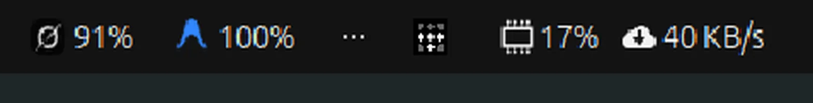

# AI Limits

Desktop tray + glance for **Google Antigravity (`agy`)** and **xAI Grok (`omp` / xai-oauth)** remaining quota.

No background polling. Fetches once at start, then only when you hit Refresh (both, or AGY / Grok separately).



```
systray:  [Antigravity] 100%    [Grok] 66%
click  →  glance (buckets, reset, Refresh AGY / Refresh Grok / Open card)
pies   →  corner refresh on each ring; header refresh does both
```

## Supported OS

| Platform | Tray chips | Glance menu | Floating card | GNOME panel chip (Vitals-style) |
|---|---|---|---|---|
| **Ubuntu GNOME 24.04+** (GNOME 46–51), Wayland or X11 | Yes (AppIndicator) | Yes | Yes | Yes (after one logout) |
| Other **GNOME 45–51** (Fedora, Debian, Arch, Pop!_OS) | Yes if AppIndicator/KStatusNotifierItem is enabled | Yes | Yes | Yes |
| **KDE Plasma**, Cinnamon, XFCE (with SNI plugin) | Yes | Yes | Yes | No (GNOME extension only) |
| Windows, macOS, Android, iOS | No | No | No | No |

Tested on **Ubuntu GNOME 50.1, Wayland**.

**Not a phone widget. Not a browser extension.** Linux desktop only.

### Desktop extras

- **GNOME**: Ubuntu already ships `ubuntu-appindicators`. On Fedora/Arch enable **AppIndicator and KStatusNotifierItem Support**.
- **GNOME panel chip** (text next to Vitals): Shell cannot hot-load a new extension. Install, then **log out and back in once**.
- **KDE**: tray works without that extension. Skip the GNOME Shell piece.

## What you need

### 1. System packages

**Debian / Ubuntu**

```bash
sudo apt install python3 python3-gi python3-cairo \
  gir1.2-gtk-4.0 gir1.2-adw-1 gir1.2-gdkpixbuf-2.0 \
  gnome-shell-extension-appindicator
```

(`gnome-shell-extension-appindicator` is already installed as `ubuntu-appindicators` on Ubuntu Desktop.)

**Fedora**

```bash
sudo dnf install python3 python3-gobject python3-cairo \
  gtk4 libadwaita gdk-pixbuf2 \
  gnome-shell-extension-appindicator
```

**Arch**

```bash
sudo pacman -S python python-gobject python-cairo gtk4 libadwaita gdk-pixbuf2
# then enable the AppIndicator GNOME extension from extensions.gnome.org
```

Python **3.10+**. GTK **4**, libadwaita **1**.

### 2. CLIs the widget reads

| Tool | Why | Check |
|---|---|---|
| [`agy`](https://antigravity.google/docs/cli/overview) (Antigravity CLI) | `agy -p /usage` | `agy --version` then `agy -p /usage` |
| [`omp`](https://github.com/can1357/oh-my-pi) (Oh My Pi) | `omp usage --json --provider xai-oauth` | `omp usage --json --provider xai-oauth` |

Both must be on `PATH` (typically `~/.local/bin`) and **already signed in**. The widget does not log you in.

```bash
# AGY should print four quota lines
agy -p /usage

# Grok should print JSON with SuperGrok weekly credits
omp usage --json --provider xai-oauth
```

If either command fails, fix that first. The widget only wraps those two calls.

## Install (from git)

```bash
git clone https://github.com/pranaystark/ai-limits.git
cd ai-limits
chmod +x install.sh uninstall.sh ai-limits
./install.sh
```

User-local only. **No root**, unless you still need the distro packages above.

What `install.sh` does:

| Path | Role |
|---|---|
| `~/.local/share/ai-limits/` | App code, CSS, icons |
| `~/.local/bin/ai-limits` | Command |
| `~/.local/share/applications/org.local.AiLimits.desktop` | App menu entry |
| `~/.config/autostart/org.local.AiLimits.desktop` | Start hidden at login |
| `~/.local/share/dbus-1/services/org.local.AiLimits.service` | D-Bus activate |
| `~/.local/share/gnome-shell/extensions/ai-limits@local/` | Optional GNOME panel chip |

Then:

```bash
# ensure ~/.local/bin is on PATH
export PATH="$HOME/.local/bin:$PATH"

ai-limits --hidden
```

Two chips should appear in the **top-right indicator cluster** (same area as Remmina / updates), **not** next to Vitals until you log out once.

### First-time GNOME panel chip

```bash
gnome-extensions enable ai-limits@local   # may no-op until next session
```

Log out and in. You should get `AGY 100% · Grok 66%` on the main status bar, click for the same glance, right-click for Refresh AGY / Refresh Grok / Refresh both.

## Usage

| Control | Action |
|---|---|
| Left-click tray chip | Glance for that provider |
| Middle-click tray chip | Refresh that provider only |
| Glance → Refresh AGY / Grok | Same |
| Glance → Open card | Frameless card with pies |
| Pie-corner refresh | Refresh that provider only |
| Header refresh | Refresh both |
| `F5` / `Ctrl+R` | Refresh both |
| Escape / × | Hide card (process stays) |

No timer. It will not hit Google or xAI until you refresh (or restart the app).

### Commands

```bash
ai-limits              # start; shows card + tray
ai-limits --hidden     # tray only (autostart uses this)
ai-limits --fetch      # write ~/.cache/ai-limits/state.json and exit
ai-limits --fetch --agy
ai-limits --fetch --grok
```

## Uninstall

```bash
./uninstall.sh
# optional:
rm -rf ~/.cache/ai-limits
killall ai_limits.py 2>/dev/null || true
```

## Project layout

```
ai-limits/
  README.md
  install.sh                 # user-local install
  uninstall.sh
  ai-limits                  # run from a git checkout
  ai_limits.py               # fetch + GTK card + SNI tray
  style.css
  icons/
    antigravity.svg          # AGY tray mark
    grok.png                 # Grok tray mark (preferred)
    grok.svg                 # fallback
  gnome-extension/
    metadata.json            # uuid ai-limits@local, GNOME 45–51
    extension.js
    stylesheet.css
```

Runtime state (not in git): `~/.cache/ai-limits/state.json`.

## Troubleshooting

**No tray chips**

- Ubuntu: Settings → Ubuntu Desktop / Extensions → **Ubuntu AppIndicators** on.
- Fedora/Arch: enable **AppIndicator and KStatusNotifierItem Support**, then log out.
- Confirm the process: `pgrep -af ai_limits.py`
- Start in the foreground: `ai-limits --hidden` and watch stderr.

**Glance does not open**

- Single left-click. The glance is the indicator **menu**, not a new window.
- “Open card” in that menu opens the pie window.

**Panel chip next to Vitals missing**

- Expected until **one GNOME logout**. Shell does not load new extensions live.
- `ls ~/.local/share/gnome-shell/extensions/ai-limits@local`

**`agy -p /usage` hangs or errors**

- Sign in with `agy` in a terminal. Token lives in the GNOME keyring (`service=antigravity`).
- Timeout is 60s; a cold call can take ~20–30s. The pie shows a spinner.

**`omp usage` empty / not xai-oauth**

- `omp` must be logged in with Grok OAuth (`xai-oauth`). `~/.omp/agent/config.yml` `modelRoles.default` is often `xai-oauth/grok-4.6`.

**`~/.local/bin` not found**

```bash
echo 'export PATH="$HOME/.local/bin:$PATH"' >> ~/.profile
```

Then log in again.

## Development

```bash
cd ai-limits
python3 ai_limits.py --hidden
# or
./ai-limits --hidden
```

Requires a graphical session (`WAYLAND_DISPLAY` or `DISPLAY`) and a session D-Bus (`org.kde.StatusNotifierWatcher`).
